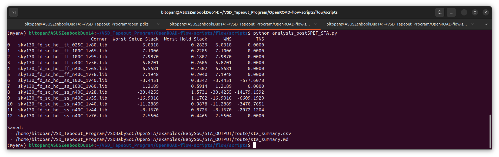

# Week 8: Post-Layout STA & Timing Graphs Across PVT Corners for Routed VSDBabySoC 
 
The focus of this week is to validate the timing behavior of the VSDBabySoC design after routing by performing post-layout, multi-corner Static Timing Analysis (STA) with full SPEF-based parasitic annotation. Building upon the SPEF extraction from Week 7, the analysis explores how real interconnect effects, wire RC delays, and PVT variations shape the final timing characteristics of the chip. This week also introduces automated multi-corner STA scripting, structured extraction of timing metrics using Python, and a detailed comparison between post-synthesis and post-route timing across all corners. The goal is to understand how physical design transforms timing margins and to establish layout-aware timing closure as a critical step before tape-out.

---

## 📜 Table of Contents
[📋 Prerequisites](#-prerequisites) <br>
[1. Required Files](#1-required-files)<br>
[2. Procedure](#2-procedure)<br>
[3. Results](#3-results)<br>
[4. Comparison With Post-Synthesis STA Reports (Week 3)](#4-comparison-with-post-synthesis-sta-reports-week-3)<br>
[5. Interpretation and Discussion](#5-interpretation-and-discussion)<br>
[6. Conclusions](#6-conclusions)<br>
[🏁 Final Remarks](#-final-remarks)

---

## 📋 Prerequisites
- Basic understanding of Linux commands.
- Successful installation of the OpenROAD in [Week 5.](https://github.com/BitopanBaishya/RISC-V-SoC-Tapeout-Program-2025---Week-5.git)
- Successful completion of Physical Design Flow of VSDBabySoC till SPEF generation in [Week 7.](https://github.com/BitopanBaishya/RISC-V-SoC-Tapeout-Program-2025---Week-7.git)
- Required Files for post-SPEF STA analysis. [Check here](#1-required-files)

---

## 1. Required Files 
This section gives a concise but clear breakdown of all the files needed for Post-Layout STA - what each file represents, how it was produced in earlier stages of the flow, and where it can be found within the project directory. This ensures that anyone following the flow can trace the origin of every input before running multi-corner STA.

### <ins>1. Gate-Level Netlist (Post-Route).</ins>
- File name: `5_2_route.v`
- Generated in: Need to generate from the `5_2_route.odb` file.
- Purpose: This Verilog netlist is the output after placement and routing, representing the final connectivity of all standard cells along with any routing-driven buffer insertions or optimizations done by OpenROAD. It reflects the “as-routed” logical structure of the chip.
- Steps to generate the `5_2_route.v` file:
  ```
  #Invoke Openroad in terminal
  openroad

  #Read the 5_2_route.odb file
  read_db /home/bitopan/VSD_Tapeout_Program/OpenROAD-flow-scripts/flow/results/sky130hd/vsdbabysoc/base/5_2_route.odb

  #Generate the 5_2_route.v file
  write_verilog /home/bitopan/VSD_Tapeout_Program/OpenROAD-flow-scripts/flow/results/sky130hd/vsdbabysoc/base/5_2_route.v

  #Exit
  exit
  ```
  
   <div align="center">
     
   </div>
- File saved in this path: `/home/bitopan/VSD_Tapeout_Program/OpenROAD-flow-scripts/flow/results/sky130hd/vsdbabysoc/base/5_2_route.v`

### <ins>2. SPEF File (Extracted Parasitics).</ins>
- File name: `vsdbabysoc.spef`
- Generated in: Week 7 – Parasitic Extraction (OpenROAD’s ARC or OpenRCX). [Check here]()
- Purpose: This file contains all extracted parasitics from the routed layout — wire resistance, net capacitances, coupling values, pin capacitances. Annotating this into OpenSTA enables real, RC-aware timing analysis instead of ideal wires.
- Path: `/home/bitopan/VSD_Tapeout_Program/OpenROAD-flow-scripts/flow/designs/sky130hd/vsdbabysoc/vsdbabysoc.spef`

### <ins>3. Liberty Files for PVT Corners.</ins>
- File name:
  * `sky130_fd_sc_hd__tt_025C_1v80.lib`
  * `sky130_fd_sc_hd__ff_100C_1v65.lib`
  * `sky130_fd_sc_hd__ff_100C_1v95.lib`
  * `sky130_fd_sc_hd__ff_n40C_1v56.lib`
  * `sky130_fd_sc_hd__ff_n40C_1v65.lib`
  * `sky130_fd_sc_hd__ff_n40C_1v76.lib`
  * `sky130_fd_sc_hd__ss_100C_1v40.lib`
  * `sky130_fd_sc_hd__ss_100C_1v60.lib`
  * `sky130_fd_sc_hd__ss_n40C_1v28.lib`
  * `sky130_fd_sc_hd__ss_n40C_1v35.lib`
  * `sky130_fd_sc_hd__ss_n40C_1v40.lib`
  * `sky130_fd_sc_hd__ss_n40C_1v44.lib`
  * `sky130_fd_sc_hd__ss_n40C_1v76.lib`
- Generated in: Provided within the PDK.
- Purpose: Each `.lib` contains cell delays, transition tables, and setup/hold constraints for a specific Process-Voltage-Temperature (PVT) corner. OpenSTA loads these libraries to compute timing under worst, best, and typical operating conditions.
- Path: `/home/bitopan/VSD_Tapeout_Program/open_pdks/sources/sky130_fd_sc_hd/timing/`

### <ins>4. Timing Constraints (SDC File).</ins>
- File name: `4_cts.sdc`
- Generated in: Week 7 – During Clock Tree Synthesis. [Check here]()
- Purpose: Defines the design’s timing intent: clock definitions, I/O delays, false paths, multicycle paths, and all other STA constraints. This same SDC must be used consistently across synthesis, post-route STA, and multi-corner analysis.
- Path: `/home/bitopan/VSD_Tapeout_Program/OpenROAD-flow-scripts/flow/results/sky130hd/vsdbabysoc/base/4_cts.sdc`

### <ins>5. Custom IP Liberty Files (PLL & DAC).</ins>
- File name:
  * `avsddac.lib`
  * `avsdpll.lib`
- Generated in: Provided by the VSDBabySoC design package
- Purpose: Models the timing of the DAC macro’s digital pins so that its interactions with the SoC’s digital logic are correctly timing-checked.
- Path: `/home/bitopan/VSD_Tapeout_Program/OpenROAD-flow-scripts/flow/designs/sky130hd/vsdbabysoc/lib/avsddac.lib`

### <ins>6. Multi-Corner OpenSTA TCL Script.</ins>
- File name: `sta_across_pvt_route_custom.tcl`
- Generated in: Need to make it now.
- Purpose: Automates the entire STA flow — loading netlist, libraries, constraints, SPEF, defining corners, and running `report_checks` for both setup and hold across all corners. This script ensures repeatable, consistent analysis.
- Use the following content (modify the paths of files wherever required):
  ```
  ### ============================================================
  ###               VSDBabySoC  –  Post-Route STA
  ### ============================================================

  puts "\n▶ Starting Post-Route STA for VSDBabySoC...\n"

  # --------------------------------------------------------------
  # Units
  # --------------------------------------------------------------
  puts "→ Setting units..."
  set_cmd_units -time ns -capacitance pF -current mA -voltage V -resistance kOhm -distance um
  set_units      -time ns -capacitance pF -current mA -voltage V -resistance kOhm -distance um


  # --------------------------------------------------------------
  # Liberty file list
  # --------------------------------------------------------------
  puts "\n→ Loading corner list..."

  set list_of_lib_files(1)  "sky130_fd_sc_hd__tt_025C_1v80.lib"
  set list_of_lib_files(2)  "sky130_fd_sc_hd__ff_100C_1v65.lib"
  set list_of_lib_files(3)  "sky130_fd_sc_hd__ff_100C_1v95.lib"
  set list_of_lib_files(4)  "sky130_fd_sc_hd__ff_n40C_1v56.lib"
  set list_of_lib_files(5)  "sky130_fd_sc_hd__ff_n40C_1v65.lib"
  set list_of_lib_files(6)  "sky130_fd_sc_hd__ff_n40C_1v76.lib"
  set list_of_lib_files(7)  "sky130_fd_sc_hd__ss_100C_1v40.lib"
  set list_of_lib_files(8)  "sky130_fd_sc_hd__ss_100C_1v60.lib"
  set list_of_lib_files(9)  "sky130_fd_sc_hd__ss_n40C_1v28.lib"
  set list_of_lib_files(10) "sky130_fd_sc_hd__ss_n40C_1v35.lib"
  set list_of_lib_files(11) "sky130_fd_sc_hd__ss_n40C_1v40.lib"
  set list_of_lib_files(12) "sky130_fd_sc_hd__ss_n40C_1v44.lib"
  set list_of_lib_files(13) "sky130_fd_sc_hd__ss_n40C_1v76.lib"


  # --------------------------------------------------------------
  # Load analog macro Liberty files once
  # --------------------------------------------------------------
  puts "\n→ Loading DAC/PLL Liberty models..."
  read_liberty /data/VSD_Tapeout_Program/OpenROAD-flow-scripts/flow/designs/sky130hd/vsdbabysoc/lib/avsdpll.lib
  read_liberty /data/VSD_Tapeout_Program/OpenROAD-flow-scripts/flow/designs/sky130hd/vsdbabysoc/lib/avsddac.lib


  # --------------------------------------------------------------
  # Begin corner loop
  # --------------------------------------------------------------
  puts "\n============================================================"
  puts "              BEGIN PVT CORNER SWEEP"
  puts "============================================================\n"

  for {set i 1} {$i <= [array size list_of_lib_files]} {incr i} {
      puts "\n------------------------------------------------------------"
      puts " Running Corner $i  →  $list_of_lib_files($i)"
      puts "------------------------------------------------------------"

      # Load Liberty for this corner
      read_liberty /data/VSD_Tapeout_Program/open_pdks/sources/sky130_fd_sc_hd/timing/$list_of_lib_files($i)

      # Reload design
      read_verilog /data/VSD_Tapeout_Program/OpenROAD-flow-scripts/flow/results/sky130hd/vsdbabysoc/base/5_2_route.v
      link_design vsdbabysoc
      current_design

      # Constraints & parasitics
      read_sdc  /data/VSD_Tapeout_Program/OpenROAD-flow-scripts/flow/results/sky130hd/vsdbabysoc/base/4_cts.sdc
      read_spef /data/VSD_Tapeout_Program/OpenROAD-flow-scripts/flow/designs/sky130hd/vsdbabysoc/vsdbabysoc.spef
    
      puts " → Timing graph built."
      puts " → Running setup/hold analysis..."

      # Full checks
      report_checks -path_delay min_max -fields {nets cap slew input_pins fanout} -digits {4} \
          > /data/VSD_Tapeout_Program/VSDBabySoC/OpenSTA/examples/BabySoC/STA_OUTPUT/route/min_max_$list_of_lib_files($i).txt

      # WNS & TNS summary logs
      exec echo "\n$list_of_lib_files($i)" >> /data/VSD_Tapeout_Program/VSDBabySoC/OpenSTA/examples/BabySoC/STA_OUTPUT/route/sta_worst_max_slack.txt
      report_worst_slack -max -digits {4} >> /data/VSD_Tapeout_Program/VSDBabySoC/OpenSTA/examples/BabySoC/STA_OUTPUT/route/sta_worst_max_slack.txt

      exec echo "\n$list_of_lib_files($i)" >> /data/VSD_Tapeout_Program/VSDBabySoC/OpenSTA/examples/BabySoC/STA_OUTPUT/route/sta_worst_min_slack.txt
      report_worst_slack -min -digits {4} >> /data/VSD_Tapeout_Program/VSDBabySoC/OpenSTA/examples/BabySoC/STA_OUTPUT/route/sta_worst_min_slack.txt

      exec echo "\n$list_of_lib_files($i)" >> /data/VSD_Tapeout_Program/VSDBabySoC/OpenSTA/examples/BabySoC/STA_OUTPUT/route/sta_tns.txt
      report_tns -digits {4} >> /data/VSD_Tapeout_Program/VSDBabySoC/OpenSTA/examples/BabySoC/STA_OUTPUT/route/sta_tns.txt

      exec echo "\n$list_of_lib_files($i)" >> /data/VSD_Tapeout_Program/VSDBabySoC/OpenSTA/examples/BabySoC/STA_OUTPUT/route/sta_wns.txt
      report_wns -digits {4} >> /data/VSD_Tapeout_Program/VSDBabySoC/OpenSTA/examples/BabySoC/STA_OUTPUT/route/sta_wns.txt

      puts " → Corner $i complete."
  }

  puts "\n============================================================"
  puts "              END OF MULTI-CORNER STA"
  puts "============================================================\n"

  exit
  ```
- File saved in this path: `/home/bitopan/VSD_Tapeout_Program/VSDBabySoC/OpenSTA/examples/BabySoC/sta_across_pvt_route_custom.tcl`

---

## 2. Procedure
To perform post-route STA within the Docker environment, launch a container with the project directory mounted and execute the `sta_across_pvt_route_custom.tcl` script inside it. The script will generate all relevant timing reports—including setup and hold analyses, WNS, and TNS—directly within the mounted `/data` directory. Running the flow through Docker ensures a consistent, isolated, and fully reproducible analysis environment.
```
docker run -it -v /home/bitopan:/data opensta /data/VSD_Tapeout_Program/VSDBabySoC/OpenSTA/examples/BabySoC/sta_across_pvt_route_custom.tcl
```

<div align="center">
  
</div>
<div align="center">
  
</div>
<div align="center">
  
</div>

After executing the STA script, all generated timing reports can be found in the directory:
`/home/bitopan/VSD_Tapeout_Program/VSDBabySoC/OpenSTA/examples/BabySoC/STA_OUTPUT/route/`.

This folder contains the complete set of post-route analysis outputs, including detailed path-delay reports for each PVT corner (`min_max_*.txt`), worst setup and hold slack summaries (`sta_worst_max_slack.txt` and `sta_worst_min_slack.txt`), and overall timing metrics such as total negative slack (`sta_tns.txt`) and worst negative slack (`sta_wns.txt`). Together, these reports provide a comprehensive view of the BabySoC design’s timing behavior after routing.

<div align="center">
  
</div>

---

## 3. Results
To present the post-route STA output in a clear and structured manner, a Python-based parsing script was used to automatically extract key timing metrics from the generated reports. This script processes all setup and hold analysis files produced by the STA flow and compiles the essential values—Worst Setup Slack, Worst Hold Slack, WNS, and TNS—into consolidated summary formats.<br><br>
The script is named `analysis_postSPEF_STA.py` and is saved in the following path: `/home/bitopan/VSD_Tapeout_Program/OpenROAD-flow-scripts/flow/scripts/analysis_postSPEF_STA.py`.<br><br>
The contents of the script is as follows:
```
import re
import pandas as pd
import os

# ============================
# BASE INPUT AND OUTPUT PATHS
# ============================
BASE = "/home/bitopan/VSD_Tapeout_Program/VSDBabySoC/OpenSTA/examples/BabySoC/STA_OUTPUT/route"
OUTPUT_DIR = BASE  # outputs saved here

os.makedirs(OUTPUT_DIR, exist_ok=True)


# -----------------------------------------------------
# Helper: extract the last floating-point number in a line
# -----------------------------------------------------
def extract_number(line):
    nums = re.findall(r"[-+]?\d*\.\d+|\d+", line)
    if nums:
        return float(nums[-1])
    return None


# -----------------------------------------------------
# Load corner names
# -----------------------------------------------------
with open(f"{BASE}/sta_worst_max_slack.txt") as f:
    corners = [line.strip() for line in f if line.strip().startswith("sky130")]

# Prepare arrays
worst_setup_slack = []
worst_hold_slack = []
wns_list = []
tns_list = []


# -----------------------------------------------------
# Worst Setup Slack (WNS)
# -----------------------------------------------------
with open(f"{BASE}/sta_worst_max_slack.txt") as f:
    for line in f:
        if line.startswith("sky130"):
            num_line = f.readline()
            value = extract_number(num_line)
            worst_setup_slack.append(value)
            wns_list.append(value)  # WNS = same as worst setup slack


# -----------------------------------------------------
# Worst Hold Slack (WHS)
# -----------------------------------------------------
with open(f"{BASE}/sta_worst_min_slack.txt") as f:
    for line in f:
        if line.startswith("sky130"):
            num_line = f.readline()
            value = extract_number(num_line)
            worst_hold_slack.append(value)


# -----------------------------------------------------
# TNS extraction
# -----------------------------------------------------
with open(f"{BASE}/sta_tns.txt") as f:
    for line in f:
        if line.startswith("sky130"):
            num_line = f.readline()
            value = extract_number(num_line)
            tns_list.append(value)


# -----------------------------------------------------
# Create DataFrame with all four fields
# -----------------------------------------------------
df = pd.DataFrame({
    "Corner": corners,
    "Worst Setup Slack": worst_setup_slack,
    "Worst Hold Slack": worst_hold_slack,
    "WNS": wns_list,
    "TNS": tns_list
})

# Save CSV & Markdown
df.to_csv(f"{OUTPUT_DIR}/sta_summary.csv", index=False)
df.to_markdown(f"{OUTPUT_DIR}/sta_summary.md", index=False)

print(df)
print("\nSaved:")
print(f" - {OUTPUT_DIR}/sta_summary.csv")
print(f" - {OUTPUT_DIR}/sta_summary.md")
```

Then, in the path: `/home/bitopan/VSD_Tapeout_Program/OpenROAD-flow-scripts/flow/scripts/`, the script is run with the command:
```
python analysis_postSPEF_STA.py
```

<div align="center">
  
</div>

The script reads the complete set of post-route timing reports and generates two output files:
- **sta_summary.csv** — a machine-readable tabulated summary suitable for further processing or analysis.
- **sta_summary.md** — a Markdown-formatted summary that can be directly included in Github, as given below:

| Corner                            |   Worst Setup Slack |   Worst Hold Slack |      WNS |        TNS |
|:----------------------------------|--------------------:|-------------------:|---------:|-----------:|
| sky130_fd_sc_hd__tt_025C_1v80.lib |              6.0318 |             0.2829 |   0      |      0     |
| sky130_fd_sc_hd__ff_100C_1v65.lib |              7.1006 |             0.2285 |   0      |      0     |
| sky130_fd_sc_hd__ff_100C_1v95.lib |              7.987  |             0.1807 |   0      |      0     |
| sky130_fd_sc_hd__ff_n40C_1v56.lib |              5.8201 |             0.2605 |   0      |      0     |
| sky130_fd_sc_hd__ff_n40C_1v65.lib |              6.5581 |             0.2302 |   0      |      0     |
| sky130_fd_sc_hd__ff_n40C_1v76.lib |              7.1948 |             0.204  |   0      |      0     |
| sky130_fd_sc_hd__ss_100C_1v40.lib |             -3.4451 |             0.8342 |  -3.4451 |   -577.608 |
| sky130_fd_sc_hd__ss_100C_1v60.lib |              1.2189 |             0.5914 |   0      |      0     |
| sky130_fd_sc_hd__ss_n40C_1v28.lib |            -30.4255 |             1.5731 | -30.4255 | -14179.2   |
| sky130_fd_sc_hd__ss_n40C_1v35.lib |            -16.9016 |             1.1762 | -16.9016 |  -6609.19  |
| sky130_fd_sc_hd__ss_n40C_1v40.lib |            -11.2889 |             0.9878 | -11.2889 |  -3470.77  |
| sky130_fd_sc_hd__ss_n40C_1v44.lib |             -8.167  |             0.8726 |  -8.167  |  -2072.12  |
| sky130_fd_sc_hd__ss_n40C_1v76.lib |              2.5504 |             0.4465 |   0      |      0     |

Both files are saved automatically at the designated output directory: `/home/bitopan/VSD_Tapeout_Program/VSDBabySoC/OpenSTA/examples/BabySoC/STA_OUTPUT/route/`<br>
The two generated files can be checked [here.](https://github.com/BitopanBaishya/RISC-V-SoC-Tapeout-Program-2025---Week-8/tree/19f3f935dd3eec1fdafd2cd699d1317b93624867/Post-Route%20STA%20Analysis)

---

## 4. Comparison With Post-Synthesis STA Reports (Week 3)
To perform a meaningful comparison between post-synthesis and post-route timing, it was necessary to revisit the STA performed in [Week 3.](https://github.com/BitopanBaishya/RISC-V-SoC-Tapeout-Program-2025---Week-3/blob/main/README.md#4-static-timing-analysis-of-vsdbabysoc) The original Week 3 analysis had been executed only for the TT corner (sky130_fd_sc_hd__tt_025C_1v80.lib), which was insufficient for multi-corner comparison against the Week 8 post-route results.<br>
To address this, a new post-synthesis STA run was executed across the same PVT corners used for post-route analysis. This ensured that timing metrics at the synthesis stage and the routing stage were evaluated under identical corner conditions.

### <ins>1. Re-Running Post-Synthesis STA Across All Corners.</ins>
A dedicated TCL script was prepared to load the synthesized netlist, read all required `.lib` files corresponding to the PVT corners, apply the SDC constraints, and run setup/hold timing for each corner. The TCL script was named `sta_post_synth_across_pvt.tcl` and saved in the path: `/home/bitopan/VSD_Tapeout_Program/VSDBabySoC/OpenSTA/examples/BabySoC/sta_post_synth_across_pvt.tcl`.<br><br>
The contents of the TCL script is as follows:

```
### ============================================================
###   VSDBabySoC  –  Post-Synthesis STA  (Standalone OpenSTA)
### ============================================================

puts "\n▶ Starting Post-Synthesis STA for VSDBabySoC...\n"

# --------------------------------------------------------------
# Units
# --------------------------------------------------------------
puts "→ Setting units..."
set_cmd_units -time ns -capacitance pF -current mA -voltage V -resistance kOhm -distance um
set_units      -time ns -capacitance pF -current mA -voltage V -resistance kOhm -distance um


# --------------------------------------------------------------
# Liberty Corners
# --------------------------------------------------------------
puts "\n→ Loading corner list..."

set list_of_lib_files(1)  "sky130_fd_sc_hd__tt_025C_1v80.lib"
set list_of_lib_files(2)  "sky130_fd_sc_hd__ff_100C_1v65.lib"
set list_of_lib_files(3)  "sky130_fd_sc_hd__ff_100C_1v95.lib"
set list_of_lib_files(4)  "sky130_fd_sc_hd__ff_n40C_1v56.lib"
set list_of_lib_files(5)  "sky130_fd_sc_hd__ff_n40C_1v65.lib"
set list_of_lib_files(6)  "sky130_fd_sc_hd__ff_n40C_1v76.lib"
set list_of_lib_files(7)  "sky130_fd_sc_hd__ss_100C_1v40.lib"
set list_of_lib_files(8)  "sky130_fd_sc_hd__ss_100C_1v60.lib"
set list_of_lib_files(9)  "sky130_fd_sc_hd__ss_n40C_1v28.lib"
set list_of_lib_files(10) "sky130_fd_sc_hd__ss_n40C_1v35.lib"
set list_of_lib_files(11) "sky130_fd_sc_hd__ss_n40C_1v40.lib"
set list_of_lib_files(12) "sky130_fd_sc_hd__ss_n40C_1v44.lib"
set list_of_lib_files(13) "sky130_fd_sc_hd__ss_n40C_1v76.lib"


# --------------------------------------------------------------
# Load analog macros
# --------------------------------------------------------------
puts "\n→ Loading DAC/PLL Liberty models..."

read_liberty /data/VSD_Tapeout_Program/OpenROAD-flow-scripts/flow/designs/sky130hd/vsdbabysoc/lib/avsdpll.lib
read_liberty /data/VSD_Tapeout_Program/OpenROAD-flow-scripts/flow/designs/sky130hd/vsdbabysoc/lib/avsddac.lib


# --------------------------------------------------------------
# Paths
# --------------------------------------------------------------
set SYN_NETLIST "/data/VSD_Tapeout_Program/OpenROAD-flow-scripts/flow/results/sky130hd/vsdbabysoc/base/1_synth.v"
set SYN_SDC     "/data/VSD_Tapeout_Program/OpenROAD-flow-scripts/flow/results/sky130hd/vsdbabysoc/base/1_synth.sdc"

set OUT "/data/VSD_Tapeout_Program/VSDBabySoC/OpenSTA/examples/BabySoC/STA_OUTPUT/synthesis"
exec mkdir -p $OUT

# ----------- THIS FIXES DUPLICATION ----------------
exec echo -n > $OUT/sta_worst_max_slack.txt
exec echo -n > $OUT/sta_worst_min_slack.txt
exec echo -n > $OUT/sta_tns.txt
exec echo -n > $OUT/sta_wns.txt
# ----------------------------------------------------


# --------------------------------------------------------------
# Begin STA loop
# --------------------------------------------------------------
puts "\n============================================================"
puts "              BEGIN POST-SYNTH MULTI-CORNER STA"
puts "============================================================\n"

for {set i 1} {$i <= [array size list_of_lib_files]} {incr i} {

    puts "\n------------------------------------------------------------"
    puts " Running Corner $i  →  $list_of_lib_files($i)"
    puts "------------------------------------------------------------"

    read_liberty /data/VSD_Tapeout_Program/open_pdks/sources/sky130_fd_sc_hd/timing/$list_of_lib_files($i)
    read_verilog $SYN_NETLIST

    link_design vsdbabysoc
    current_design

    read_sdc $SYN_SDC

    report_checks -path_delay min_max -fields {nets cap slew input_pins fanout} -digits {4} \
        > $OUT/min_max_$list_of_lib_files($i).txt

    exec echo "\n$list_of_lib_files($i)" >> $OUT/sta_worst_max_slack.txt
    report_worst_slack -max -digits {4} >> $OUT/sta_worst_max_slack.txt

    exec echo "\n$list_of_lib_files($i)" >> $OUT/sta_worst_min_slack.txt
    report_worst_slack -min -digits {4} >> $OUT/sta_worst_min_slack.txt

    exec echo "\n$list_of_lib_files($i)" >> $OUT/sta_tns.txt
    report_tns -digits {4} >> $OUT/sta_tns.txt

    exec echo "\n$list_of_lib_files($i)" >> $OUT/sta_wns.txt
    report_wns -digits {4} >> $OUT/sta_wns.txt

    puts " → Corner $i complete."
}

puts "\n============================================================"
puts "            END OF POST-SYNTHESIS MULTI-CORNER STA"
puts "============================================================\n"

exit
```

This updated synthesis-level STA generated the complete set of reports for all corners, which were stored at: `/home/bitopan/VSD_Tapeout_Program/VSDBabySoC/OpenSTA/examples/BabySoC/STA_OUTPUT/synthesis
`. These reports mirror the structure of the post-route outputs, making them suitable for one-to-one comparison.

The `sta_post_synth_across_pvt.tcl` file is run as follows:
```
docker run -it -v /home/bitopan:/data opensta /data/VSD_Tapeout_Program/VSDBabySoC/OpenSTA/examples/BabySoC/sta_post_synth_across_pvt.tcl
```

<div align="center">
  
</div>
<div align="center">
  
</div>
<div align="center">
  
</div>

### <ins>2. Automated Extraction of Synthesis-Level Timing Metrics.</ins>
To process the newly generated synthesis reports, a Python script—similar to the one used in the post-route stage—was used to extract:
- Worst Setup Slack
- Worst Hold Slack
- Worst Negative Slack (WNS)
- Total Negative Slack (TNS)

The Python script is named as `analysis_postSYNTH_STA.py` and stored in the path: `/home/bitopan/VSD_Tapeout_Program/OpenROAD-flow-scripts/flow/scripts/`.<br><br>
The Python script used is as follows:
```
import re
import pandas as pd
import os

# ============================
# BASE INPUT AND OUTPUT PATHS
# ============================
BASE = "/home/bitopan/VSD_Tapeout_Program/VSDBabySoC/OpenSTA/examples/BabySoC/STA_OUTPUT/synthesis"
OUTPUT_DIR = BASE

os.makedirs(OUTPUT_DIR, exist_ok=True)


# -----------------------------------------------------
# Helper: extract LAST floating number in a line
# -----------------------------------------------------
def extract_number(line):
    nums = re.findall(r"[-+]?\d*\.\d+|\d+", line)
    if nums:
        return float(nums[-1])
    return None


# -----------------------------------------------------
# Required input files
# -----------------------------------------------------
MAX_FILE = f"{BASE}/sta_worst_max_slack.txt"
MIN_FILE = f"{BASE}/sta_worst_min_slack.txt"
TNS_FILE = f"{BASE}/sta_tns.txt"

for file in [MAX_FILE, MIN_FILE, TNS_FILE]:
    if not os.path.exists(file):
        raise FileNotFoundError(f"\n❌ Missing required STA file:\n{file}\n")


# -----------------------------------------------------
# Load corner names
# -----------------------------------------------------
with open(MAX_FILE) as f:
    corners = [line.strip() for line in f if line.strip().startswith("sky130")]


# Arrays to fill
worst_setup_slack = []
worst_hold_slack = []
wns_list = []
tns_list = []


# -----------------------------------------------------
# Worst Setup Slack + WNS (always ≤ 0)
# -----------------------------------------------------
with open(MAX_FILE) as f:
    for line in f:
        if line.startswith("sky130"):
            val = extract_number(f.readline())

            # Setup slack can be positive, but WNS must be ≤ 0
            worst_setup_slack.append(val)

            # Compute real WNS: min(val, 0)
            wns_list.append(min(val, 0))


# -----------------------------------------------------
# Worst Hold Slack (WHS)
# -----------------------------------------------------
with open(MIN_FILE) as f:
    for line in f:
        if line.startswith("sky130"):
            val = extract_number(f.readline())
            worst_hold_slack.append(val)


# -----------------------------------------------------
# Total Negative Slack (TNS)
# -----------------------------------------------------
with open(TNS_FILE) as f:
    for line in f:
        if line.startswith("sky130"):
            val = extract_number(f.readline())
            tns_list.append(val)


# -----------------------------------------------------
# Create DataFrame
# -----------------------------------------------------
df = pd.DataFrame({
    "Corner": corners,
    "Worst Setup Slack": worst_setup_slack,
    "Worst Hold Slack": worst_hold_slack,
    "WNS": wns_list,
    "TNS": tns_list
})


# -----------------------------------------------------
# Save the outputs
# -----------------------------------------------------
df.to_csv(f"{OUTPUT_DIR}/sta_summary_synth.csv", index=False)
df.to_markdown(f"{OUTPUT_DIR}/sta_summary_synth.md", index=False)

print(df)
print("\nSaved:")
print(f" - {OUTPUT_DIR}/sta_summary_synth.csv")
print(f" - {OUTPUT_DIR}/sta_summary_synth.md")
```

The script is run with the following command:
```
python analysis_postSYNTH_STA.py
```

<div align="center">
  
</div>

The script parsed all synthesis STA outputs and generated two summary files:
- **sta_summary_synth.csv**
- **sta_summary_synth.md**

The Post-Synthesis STA reports are as follows:
| Corner                            |   Worst Setup Slack |   Worst Hold Slack |      WNS |       TNS |
|:----------------------------------|--------------------:|-------------------:|---------:|----------:|
| sky130_fd_sc_hd__tt_025C_1v80.lib |              7.5324 |             0.3096 |   0      |     0     |
| sky130_fd_sc_hd__ff_100C_1v65.lib |              8.3122 |             0.2491 |   0      |     0     |
| sky130_fd_sc_hd__ff_100C_1v95.lib |              8.8805 |             0.196  |   0      |     0     |
| sky130_fd_sc_hd__ff_n40C_1v56.lib |              7.5135 |             0.2915 |   0      |     0     |
| sky130_fd_sc_hd__ff_n40C_1v65.lib |              7.981  |             0.2551 |   0      |     0     |
| sky130_fd_sc_hd__ff_n40C_1v76.lib |              8.3959 |             0.2243 |   0      |     0     |
| sky130_fd_sc_hd__ss_100C_1v40.lib |              0.9453 |             0.9053 |   0      |     0     |
| sky130_fd_sc_hd__ss_100C_1v60.lib |              4.1401 |             0.642  |   0      |     0     |
| sky130_fd_sc_hd__ss_n40C_1v28.lib |            -17.1518 |             1.8296 | -17.1518 | -5778.63  |
| sky130_fd_sc_hd__ss_n40C_1v35.lib |             -7.9686 |             1.3475 |  -7.9686 | -1871.7   |
| sky130_fd_sc_hd__ss_n40C_1v40.lib |             -4.1543 |             1.1249 |  -4.1543 |  -650.898 |
| sky130_fd_sc_hd__ss_n40C_1v44.lib |             -1.8958 |             0.9909 |  -1.8958 |  -121.73  |
| sky130_fd_sc_hd__ss_n40C_1v76.lib |              5.2885 |             0.5038 |   0      |     0     |

Both files were saved in the same synthesis STA directory: `/home/bitopan/VSD_Tapeout_Program/VSDBabySoC/OpenSTA/examples/BabySoC/STA_OUTPUT/synthesis/`. These summaries provided a structured view of timing behavior at the synthesis stage across all PVT corners.<br>
The two generated files can be checked [here.](https://github.com/BitopanBaishya/RISC-V-SoC-Tapeout-Program-2025---Week-8/tree/4e077b40590a864cae5995f33baefcf1f8a44c9a/Post-Synthesis%20STA%20Analysis)

### <ins>3. Post-Synthesis vs Post-Route Comparison.</ins>
Using the CSV summaries from:
- **post-route STA** (`sta_summary.csv`)
- **post-synthesis STA** (`sta_summary_synth.csv`)

a consolidated comparison was performed across all PVT corners. For clarity, each of the four key metrics was visualized separately:

- Worst Setup Slack comparison:
  <div align="center">
    
  </div>

- Worst Hold Slack comparison:
  <div align="center">
    
  </div>

- Worst Negative Slack (WNS) comparison:
  <div align="center">
    
  </div>

- Total Negative Slack (TNS) comparison:
  <div align="center">
    
  </div>

Each metric was plotted in a dedicated graph, providing a corner-by-corner visualization of how timing behavior changes from synthesis to layout-aware analysis. These graphs highlight the impact of parasitics, routing delays, and physical effects introduced after synthesis—offering a complete understanding of timing evolution between Week 3 and Week 8.

---

## 5. Interpretation and Discussion
The comparison between post-synthesis and post-route STA across all PVT corners offers a clear view into how routing parasitics reshape timing behavior once real interconnect effects are introduced. The trends observed in the four comparison plots highlight consistent physical-design phenomena that emerge after placement, routing, and SPEF extraction.

### <ins>1. Worst Setup Slack (WSS) Trends.</ins>
From the setup slack comparison, several observations stand out:
1. At **typical and fast corners**, the post-route slack closely follows the post-synthesis values, with only minor degradation. This is expected—interconnect delays increase slightly due to added wire resistance and capacitance, but the overall timing margin remains healthy.
2. A sharp setup degradation appears at slow PVT corners, most notably at `sky130_fd_sc_hd__ss_n40C_1v28.lib`, where the post-route Worst Setup Slack drops significantly (≈ −30 ns). The post-synthesis slack at the same corner shows a much smaller violation.<br>
   This divergence is rooted in slow-corner physics:
   - Slow process + low voltage + low temperature → cells switch slower, wire RC becomes dominant, and path delays stretch heavily.
   - Post-synthesis STA does not account for routed interconnect parasitics, so the delay increase is underestimated.
   - SPEF annotation introduces the actual RC load, causing a large drop in setup slack.

### <ins>2. Worst Hold Slack (WHS) Trends.</ins>
The hold slack comparison shows the opposite behavior:
1. Across most corners, post-route hold slack is slightly lower than the post-synthesis values, but the deviation is small.
2. At faster corners, such as FF corners, hold slack tightens noticeably due to reduced intrinsic cell delay.
3. No extreme outliers or catastrophic hold failures appear after routing, which indicates:
   - Balanced routing,
   - Limited insertion of short, ultra-fast paths, and
   - Reasonable clock tree behavior.

Unlike setup, hold timing is impacted more by cell delay than wire delay, and thus shows less variation between synthesis and routed STA.

### <ins>3. Worst Negative Slack (WNS) Comparison.</ins>
The WNS plot reinforces the setup trend:
1. WNS is zero (or very close to zero) at several corners in both synthesis and post-route STA.
2. The dominant violation appears again at the SS low-voltage corner, where post-route WNS drops dramatically (~ −33 ns).
3. The corresponding post-synthesis WNS dip is much smaller, confirming that routing parasitics are the primary contributor.

This emphasizes that design closure must always consider slow process–weak voltage corners, because the parasitic impact becomes disproportionately large there.

### <ins>4. Total Negative Slack (TNS) Comparison.</ins>
TNS amplifies the WNS trend:
1. For most corners, TNS remains zero or near-zero in both analyses.
2. At the slow SS corner, however, post-route TNS spikes sharply, reaching large negative values due to multiple violating paths.
3. The post-synthesis TNS remains relatively small, showing that many near-critical paths collapsed only after interconnect parasitics were applied.

---

## 6. Conclusions
Based on the plotted trends, the following conclusions can be drawn:
1. Routing introduces significant additional delay on long or high-fanout paths. Especially under the SS corner, where slow cells + heavy interconnect cause setup timing degradation.
2. Hold timing remains relatively stable. Only mild tightening appears across corners, with no severe violations after routing.
3. Post-synthesis STA alone is insufficient for timing signoff. The disparity between synthesis-level and routed-level slack—especially in slow corners—demonstrates why SPEF-based STA is mandatory before tape-out.
4. Corner sensitivity is strongly visible. Slow corners magnify parasitic effects, while fast corners tend to be more tolerant.
5. Multiple paths become critical after routing. This is reflected in the steep rise in TNS, indicating that several near-critical paths accumulated violations only after full RC annotation.

---

## 🏁 Final Remarks
Week 8 brought the VSDBabySoC flow to a true signoff-level perspective by shifting from ideal, synthesis-based timing to post-layout, parasitic-aware STA across all PVT corners. Running multi-corner analysis with SPEF annotation revealed how routing and real interconnect effects reshape timing—especially at slow corners, where setup slack degraded sharply due to dominant RC delays.

Using automated scripts to extract and compare metrics from both synthesis and post-route stages provided a clear picture of timing evolution throughout the flow. While hold timing remained largely stable, setup, WNS, and TNS clearly highlighted the impact of physical design on critical paths.

This week completed the timing-analysis loop for VSDBabySoC, grounding the design’s performance in physical reality and reinforcing why post-layout, multi-corner STA is essential before tape-out.

>[!IMPORTANT]
> For easy navigation to all the weeks of the program, please visit the [Master Repository](https://github.com/BitopanBaishya/VSD-Tapeout-Program-2025.git).


